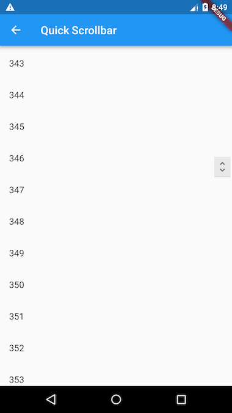
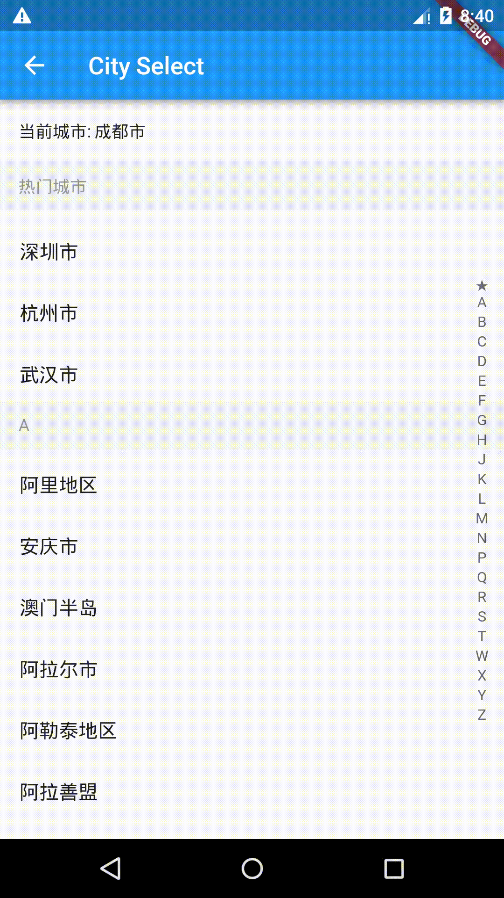

[English](README-EN.md)|中文简体
# flukit

*flukit* （Flutter UI Kit）是一个Flutter Widget库。

## 注意

本项目正在开发中，目前没有稳定版，我们暂时不建议您在生产中使用，欢迎大家贡献代码。

## 贡献代码须知

### 工程目录

```
flukit
	--lib           //示例目录
	--package_src
	  --lib
	   --src  //widget库目录
	--docs //文档目录，文档必须是markdown格式
      --images //文档用到的图片都放在这里，如截图
      --chs //中文文档目录
      --en //英文文档目录
```

### 运行Demo

```
flutter run
```

### **提交代码须知**

如果你添加了一个，请遵循如下规则：

1. 尽可能多的添加注释，文档注释为三斜线"///"
2. 添加一个新的Widget后，请在Demo目录添加使用示例，示例应该纯净无干扰，如果一个widget需要多个示例，可以创建一个二级页面，可以参照Pull Refresh、QuickSelectListView。
3. 如果可以，请尽可能在doc目录下为widget添加使用文档，文档必须是markdown格式，文档名应与widget文件名同名

## Widgets

- QuickScrollbar
- TurnBox
- AnimatedRotationBox
- PullRefreshBox
- ScaleView
- Swiper
- GradientCircularProgressIndicator
- QuickSelectListView(SuspensionListView、IndexBar)

## Demo部分截图







