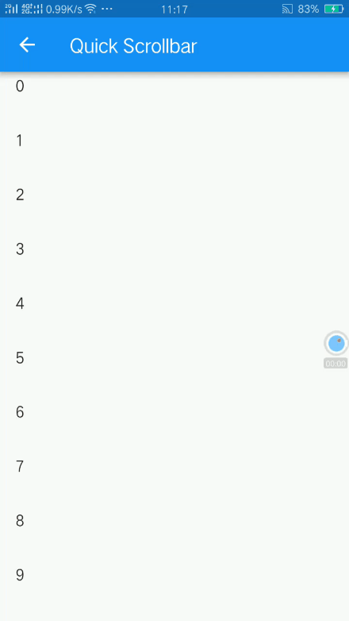
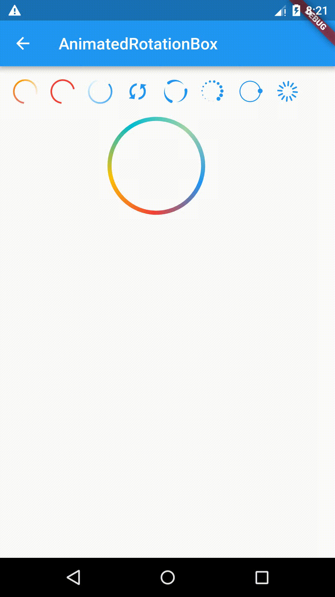
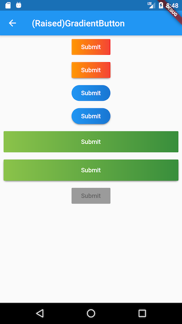
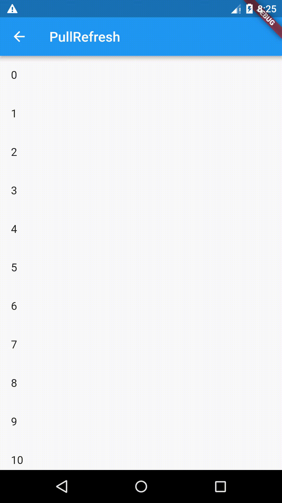

[English](README-EN.md)|中文简体

# Flukit [](https://pub.dartlang.org/packages/flukit)

*flukit* （Flutter UI Kit）是一个Flutter Widget库。

## 注意

本项目正在持续迭代中，欢迎大家贡献代码。  

原QuickSelectListView迁移至[AzListView](https://github.com/flutterchina/azlistview)  
QuickSelectListView 更改为 AzListView  
SuspensionListView 更改为 SuspensionView  

## 贡献代码须知

### 工程目录

```
flukit
	--lib           //示例目录
	--package_src
	  --lib
	   --src  //widget库目录
	--docs //文档目录，文档必须是markdown格式
      --images //文档用到的图片都放在这里，如截图
      --chs //中文文档目录
      --en //英文文档目录
```

### 运行Demo

```
flutter run
```

### **提交代码须知**

如果你添加了一个组件，请遵循如下规则：

1. 尽可能多的添加注释，文档注释为三斜线"///"
2. 添加一个新的Widget后，请在Demo目录添加使用示例，示例应该纯净无干扰，如果一个widget需要多个示例，可以创建一个二级页面，可以参照水印组件 WaterMark 的示例。
3. 如果可以，请尽可能在doc 目录下为widget添加使用文档，文档必须是markdown格式，文档名应与widget文件名同名

## Widgets

| Widget                                     | Description                                                  | Related                                                      |
| ------------------------------------------ | ------------------------------------------------------------ | ------------------------------------------------------------ |
| AfterLayout                                | 在布局结束后，可以拿到对应的RenderObject对象。非常实用的一个组件，需要慢慢体会。 |                                                              |
| AccurateSizedBox                           | 一个精确的SizedBox。SizedBox 会将父组件的约束传递给其子组件，所以有些时候子组件大小并不等于我们通过SizedBox指定的宽高，而 AccurateSizedBox 能很好解决这个问题。具体见示例。 | SizedBox                                                     |
| AnimatedRotationBox                        | Rotates child forever                                        |                                                              |
| DoneWidget                                 | 完成提示组件（执行一个打勾动画）                             |                                                              |
| GradientButton<br />ElevatedGradientButton | 背景色渐变按钮                                               |                                                              |
| GradientCircularProgressIndicator          | 一个支持颜色渐变的圆形进度指示器                             |                                                              |
| HitTestBlocker                             | 通过该组件可以拦截 hit test 流程。                           |                                                              |
| KeepAliveWrapper                           | 包括可滚动组件的子组件后，该子组件将会被缓存，意味着即使滑出屏幕也不会被销毁。 |                                                              |
| LeftRightBox                               | 支持左-右布局的组件，不会有文本溢出，右组件最多占总显示宽度的一半。 |                                                              |
| LayoutLogPrint                             | 一个帮助组件：在调试模式下可以将父组件传递的约束信息打印出来。 |                                                              |
| LogListenerScope                           | 监听是否有日志（print）到来。是一个调试工具，可以拦截应用内print的输出然后显示在 UI 上，具体见示例demo. | VerticalLogPanel、LogPanel                                   |
| VerticalLogPanel                           | 显示`print`输出的log。它会将显示区域分为上下两部分，子组件显示在上面，日志面板显示在下面。 | LogPanel、LogListenerScope                                   |
| LogPanel                                   | 显示`print`输出的log.                                        | VerticalLogPanel、LogListenerScope                           |
| PullRefreshScope                           | 下拉刷新（和flutter自带的有两点不同：PullRefreshScope 是手指抬起后才刷新，另外刷新完成后返回时会执行动画） | SliverPullRefreshIndicator                                   |
| SliverPullRefreshIndicator                 | 下拉舒新指示器，配合PullRefreshScope 使用。                  | PullRefreshScope                                             |
| QuickScrollbar                             | 可拖动的滚动条                                               |                                                              |
| Swiper                                     | 一个轮播组件                                                 | RectangleSwiperIndicator、CircleSwiperIndicator、SwiperController |
| ScaleView                                  | 可以对子组件进行缩放（支持双指伸缩、双击）                   |                                                              |
| SliverFlexibleHeader                       | 一个随着用户下拉，高度可以伸缩的 sliver header，通常为 CustomScrollView 的第一子sliver。常见的场景是微信朋友圈个人主页顶部图下拉时的弹性效果。 | SliverPullRefreshIndicator                                   |
| SliverPersistentHeaderToBox                | 和 [SliverPersistentHeader]功能类似，但不同是[SliverPersistentHeaderToBox]   能够直接包含一个盒模型子组件（Box widget），并且高度会使用子组件高度。 |                                                              |
| SliverHeaderDelegate                       | [SliverPersistentHeader] 的帮助类，用于快速创建delegate 。   |                                                              |
| SlideTransitionX                           | 实现同向滑动效果，通常和[AnimatedSwitcher]一起使用，具体效果见示例demo. |                                                              |
| OverflowWithTranslateBox                   | 可以将子组件沿着某个方向平移x像素，平移后，反方向不会出现空白。原理是该组件允许子组件的绘制空间大小在平移方向超过当前显示空间x像素。具体效果见示例demo. |                                                              |
| TurnBox                                    | 可按任意角度旋转子组件，旋转过程执行动画。                   |                                                              |
| WaterMark                                  | 水印组件                                                     | TextWaterMarkPainter、StaggerTextWaterMarkPainter            |

## Tools

| Tools                      | Description                                                  |
| -------------------------- | ------------------------------------------------------------ |
| ExtraInfoBoxConstraints    | 可以传递额外信息的 BoxConstraints。                          |
| SafeValueNotifier          | 在build/layout/paint 阶段发出通知时也能确保ValueListenableBuilder正常更新。 |
| RenderObjectAnimationMixin | 如果要在RenderObject中执行动画，则该mixin会非常有用，它封装了动画调度功能。 |


## Demo部分截图（只有少数，待补充）








