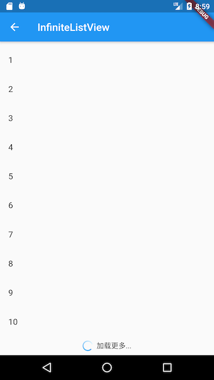

[English](README-EN.md)|中文简体

# Flukit [](https://pub.dartlang.org/packages/flukit)


*flukit* （Flutter UI Kit）是一个Flutter Widget库。

## 注意

本项目正在持续迭代中，欢迎大家贡献代码。  

原QuickSelectListView迁移至[AzListView](https://github.com/flutterchina/azlistview)  
QuickSelectListView 更改为 AzListView  
SuspensionListView 更改为 SuspensionView  

## 贡献代码须知

### 工程目录

```
flukit
	--lib           //示例目录
	--package_src
	  --lib
	   --src  //widget库目录
	--docs //文档目录，文档必须是markdown格式
      --images //文档用到的图片都放在这里，如截图
      --chs //中文文档目录
      --en //英文文档目录
```

### 运行Demo

```
flutter run
```

### **提交代码须知**

如果你添加了一个，请遵循如下规则：

1. 尽可能多的添加注释，文档注释为三斜线"///"
2. 添加一个新的Widget后，请在Demo目录添加使用示例，示例应该纯净无干扰，如果一个widget需要多个示例，可以创建一个二级页面，可以参照Pull Refresh、QuickSelectListView。
3. 如果可以，请尽可能在doc目录下为widget添加使用文档，文档必须是markdown格式，文档名应与widget文件名同名

## Widgets

| Widget名称                        | 介绍                                       |
| --------------------------------- | ------------------------------------------ |
| QuickScrollbar                    | 可拖动的滚动条                             |
| TurnBox                           | 可按任意角度旋转子组件                     |
| AnimatedRotationBox               | 可对子组件执行旋转动画                     |
| ScaleView                         | 可以对子组件进行缩放（双指伸缩）           |
| Swiper                            | 一个轮播组件                               |
| GradientButton                    | 背景色渐变按钮                             |
| RaisedGradientButton              | 背景色渐变按钮(Raised)                     |
| GradientCircularProgressIndicator | 一个支持颜色渐变的圆形进度指示器           |
| InfiniteListView                  | 支持下拉刷新的无限加载列表组件             |
| PullRefreshBox（betal）           | 下拉刷新（该组件并未成熟，将来可能会删掉） |


## Demo部分截图





